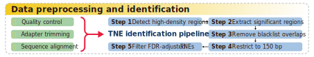

----------
- <font face = "Times New Roman" size = 4> ***[traceTNE](#tracetne)*** </font>
  - <font face = "Times New Roman" size = 3> ***[Requirement](#requirement)*** </font>
  - <font face = "Times New Roman" size = 3> ***[Usage](#usage)*** </font>
  - <font face = "Times New Roman" size = 3> ***[Citation](#citation)*** </font>
----------


# traceTNE
<font face = "Times New Roman" size = 5> **A tailored identification framework for transcribed non-coding elements (TNEs)** </font>


## Requirement
<font face = "Times New Roman" size = 4> ***To use the current release*** </font>
<font face = "Times New Roman" size = 3>
1. Linux (such as Ubuntu 22.04 LTS);
2. R 4.3 or later;
3. R library - fitdistrplus;
4. Python 3.12 or later;
5. BEDTools suite 2.30.0;
6. Jim Kent's executable programms: http://hgdownload.cse.ucsc.edu/admin/exe/.
</font>


## Usage

<font face = "Times New Roman" size = 4> ***Deploy this program locally*** </font>

```shell
$ git clone https://github.com/weylz/traceTNE.git
$ cd traceTNE
$ chmod u+x ./bin/*

# Set up environment variables by adding various software directories to PATH
$ export PATH=$(pwd)/bin:$PATH

$ traceTNE.sh -H

# Usage:    traceTNE.sh -I <...> -B <...> -S <...> [-L <...>] [-M <...>] [-V] [-H]
#
#     Note: -I, -B and -S are required.
#
# Requirement:
#     - Linux (such as Ubuntu 22.04 LTS);
#     - Python 3.12 or later;
#     - R 4.3 (library fitdistrplus);
#     - BEDTools suite v2.30.0;
#     - Jim Kent's executable programms: http://hgdownload.cse.ucsc.edu/admin/exe/.
#
# Options:
#     -H    Print this help menu.
#     -I    Label for input sample(s) (the name of the folder where the bigwig files are placed).
#     -B    Bed file for blocklist (without a header requires three columns for chromosome, start, end).
#     -S    Genome chromosome sizes (hg38.chrom.sizes or hg19.chrom.sizes).
#     -L    Minimal length of transcribed noncoding elements (default: 150 bp).
#     -M    Minimum value (included) of the transcriptional signal in the sample(s) (default: average transcriptional signal).
#     -V    The version of this tool.
```

<font face = "Times New Roman" size = 4> ***Data preprocessing is required if data in bigwig format is not available.*** </font>

```shell
# Steps:
# 1. Place all SRA files into the 00_rawData folder;
# 2. Move the script rnaseq_aligner.sh to the same path as the 00_rawData folder;
# 3. Modify the parameters genome_fa, genome_gtf and software_trimmomatic in this script.
# 4. Software for pre-processing is required to be installed, including fasterq-dump, pigz, FastQC, Trimmomatic, STAR, SAMtools and deepTools.
$ ./rnaseq_aligner.sh
```

<font face = "Times New Roman" size = 4> ***Try running traceTNE***</font>

```shell
# All bigWig files require to be moved to one folder.
$ traceTNE.sh
    -B /path/to/blocklist.bed
    -S /path/to/(hg38.chrom.sizes or hg19.chrom.sizes or ...)
    -I ProjectName(FolderName)

# Try an example
$ cd example
$ traceTNE.sh
    -B ./resources/blocklist.bed
    -S ./resources/hg38.chrom.sizes
    -I TEST
    -L 200
# The final report can be accessed in the project folder (./TEST/TNE.TEST.bed).
```


## Citation
<font face = "Times New Roman" size = 3> [Wenyong Zhu et al. TNEAtlas: a pan-cancer atlas for the comprehensive identification and systematic analysis of transcribed non-coding elements. *Under Review*. Watch this space!](./)</font>

<font face = "Times New Roman" size = 2> ***Copyright © 2025 Wenyong Zhu et al. All Rights Reserved.*** </font>
